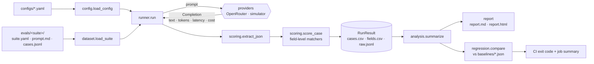

# Architecture

The harness is a small pipeline. Each stage is a separate module with a narrow interface,
so any stage can be swapped or tested on its own (for example, a different provider, a new
matcher or another report format).

## Modules

| Module | Responsibility |
|---|---|
| `dataset.py` | Suite format (`suite.yaml`, `prompt.md`, `cases.jsonl`), validation and per-field match rules |
| `scoring/parse.py` | Pulls a JSON object out of raw model text (bare, fenced, or surrounded by prose) |
| `scoring/matchers.py` | `exact`, `normalized`, `numeric` (with tolerance), `date`, `unordered_list` |
| `scoring/scorer.py` | Flattens expected JSON into leaf paths (`items[0].sku`) and scores each one |
| `providers/` | `Provider` protocol returning a `Completion`; `OpenRouterProvider` (live) and `simulatorProvider` (offline, deterministic) |
| `pricing.py` | USD per million tokens, used when the API response doesn't include cost |
| `config.py` | Run config: provider, suites, models, concurrency, regression thresholds |
| `runner.py` | Fans out suite × model × case on a thread pool; saves and reloads run artefacts |
| `analysis.py` | Pandas aggregations: per-(suite, model) summary and per-field accuracy |
| `report/` | `insights` (facts and picks) rendered as Markdown and self-contained HTML |
| `regression.py` | Baseline save/load, threshold checks, Markdown check table |
| `cli.py` | `llm-eval run`, `llm-eval report`, `llm-eval check` |

## Metrics

- **Field accuracy**: correct expected leaf fields ÷ all expected leaf fields (micro-averaged
  over the suite). Missing fields and invalid JSON count as wrong. Extra fields are ignored.
- **Exact match**: share of documents where every expected field is correct.
- **Valid JSON**: share of responses where a JSON object could be parsed.
- **Latency p50 / p95**: wall-clock seconds per call, including retries.
- **Cost per doc**: provider-reported cost when available, otherwise tokens × configured price.

## Design decisions

- **Offline-first.** `simulatorProvider` simulates models of different quality, speed and price
  from the labelled answers. It's seeded, so CI is deterministic and needs no secrets. Live
  runs use the same code path with `provider: openrouter`.
- **Rules live with the data.** Each suite declares how its fields are compared. For example,
  money uses a numeric tolerance and SKUs need an exact match. Adding a suite needs no code.
- **Artefacts are plain files.** CSV and JSONL outputs can be reloaded (`load_run`), so
  reports and checks can be rebuilt or diffed without calling the models again.
- **Regression gate on deltas, not absolutes.** CI fails when a model gets worse than the
  committed baseline. It doesn't fail just because a model is below some arbitrary bar.
  An optional floor catches outright breakage.
